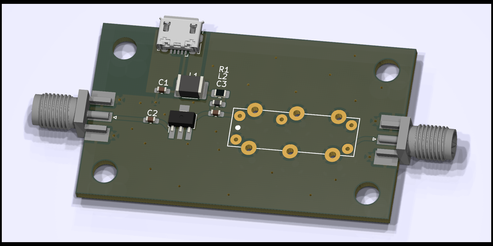

# Bandpass filter for the SDR

PCB is designed for JLCPCB 4 layer impedance controlled JLC04161H-7628 1.6mm thickness 1oz outer copper 0.5oz inner copper

## Measurements of the first prototype

| Gain   | Frequency |
|--------|-----------|
| -3dB   | 162MHz    |
| 14.2dB | 170.8MHz  |
| -3dB   | 183MHz    |
